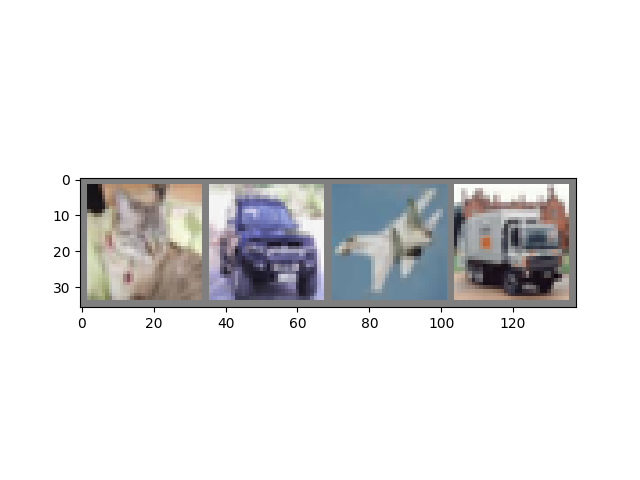
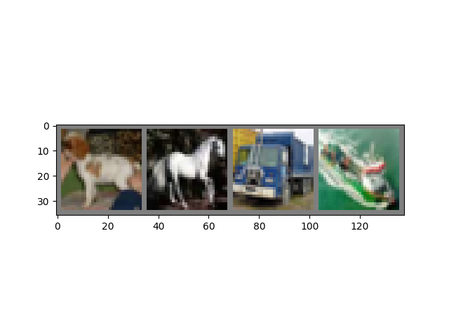
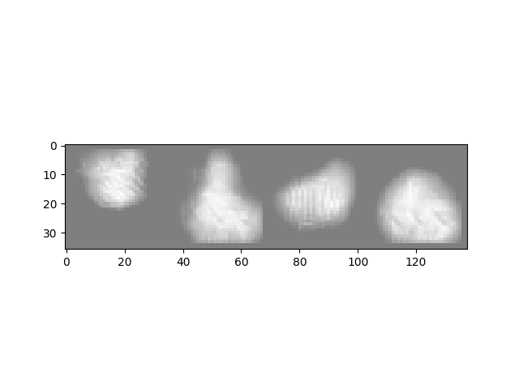
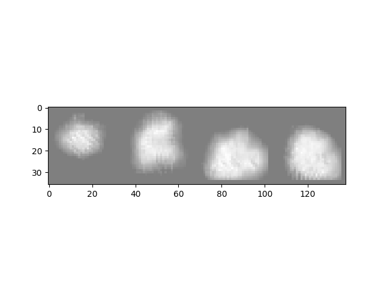
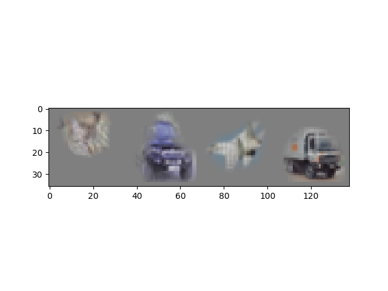
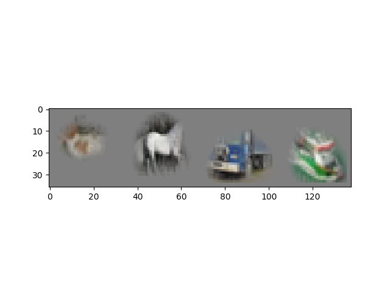

# SalienyMapper
Implementation of the paper :
Real Time Image Saliency for Black Box Classifiers
https://arxiv.org/abs/1705.07857

# Results

Example 1             |  Example 2
:-------------------------:|:-------------------------:
  |  
  |  
  |  
# Purpose
NIPS Paper Implementation Challenge . Even though the author's  implementation exists, this is an attempt to make a more user friendly version of the code and specially purposed as a learning tool for the models in theis paper.

Differences from the Official Implementation:

* Made for training the Cifar10 dataset,  oficial repo meant to train the ImageNet Dataset
*  Less Verbose , only the core details present. Loss, Model and Trainer

# Files

* model.py ->  Main model hosted
* resnet.py -> Black Box Classifier
* train_classifier -> Trains classifier Model
* train_saliency -> Trains Saliency Model

# Help
Referred to the author's repo , this repo was made on the shoulders of giants.
Official Repo: https://github.com/PiotrDabkowski/pytorch-saliency

